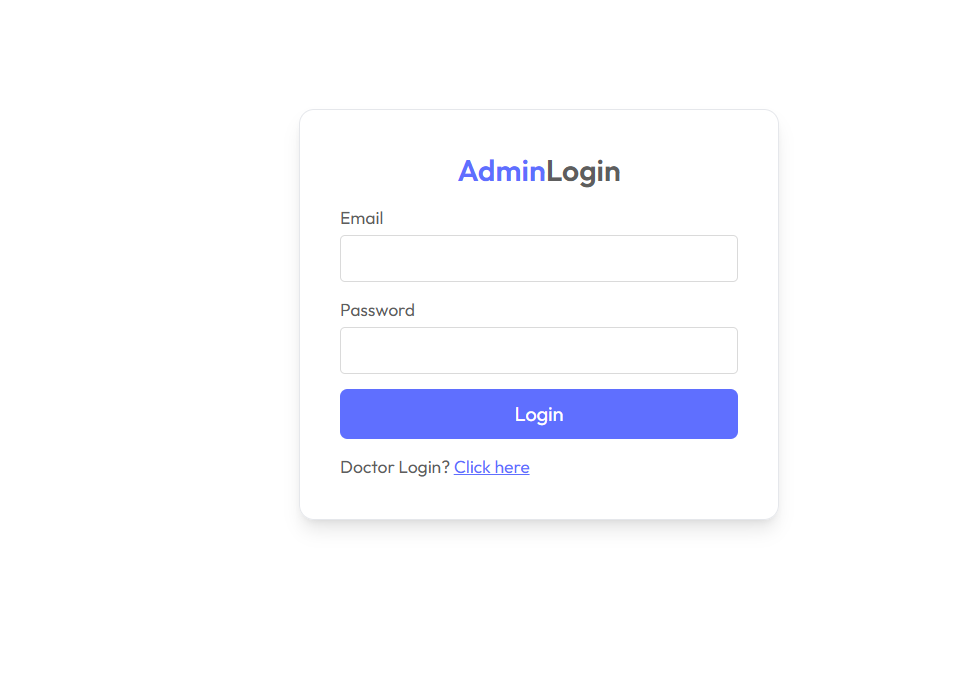

# Prescripto - Admin Dashboard (React)



<p align="center">
  <a href="https://prescripto-adminpanel.netlify.app" target="_blank" rel="noopener noreferrer"><strong>Live Admin Panel</strong></a>
</p>

The **Prescripto Admin Dashboard** is a comprehensive management interface for administrators and doctors. Built with **React** and styled with **Tailwind CSS**, it empowers authorized personnel to manage the entire platform, from doctor onboarding to daily appointment scheduling.

## 🛠️ Tech Stack

*   **Core Framework**: React 19
*   **Build Tool**: Vite
*   **Styling**: Tailwind CSS v3
*   **State Management**: Context API (`AdminContext` & `DoctorContext`)
*   **Routing**: React Router DOM v7
*   **Notifications**: React Toastify

## 📂 Project Structure

```
admin/
├── src/
│   ├── context/         # AdminContext and DoctorContext for role-based state
│   ├── pages/
│   │   ├── Admin/       # Admin-specific pages (Dashboard, AddDoctor, AllAppointments)
│   │   ├── Doctor/      # Doctor-specific pages (DoctorDashboard, DoctorProfile)
│   │   └── Login.jsx    # Unified login for Admin and Doctor roles
│   ├── components/      # Shared UI components (Sidebar, Navbar)
│   └── main.jsx         # Entry point
└── ...
```

## 🔐 Authentication & Roles

This dashboard supports two distinct user roles, managed via separate contexts:

1.  **Admin (`AdminContext`)**:
    *   **Capabilities**: Add new doctors, view all system appointments, cancel any appointment, viewing dashboard analytics.
    *   **Login**: Uses hardcoded admin credentials stored in the backend environment.

2.  **Doctor (`DoctorContext`)**:
    *   **Capabilities**: View assigned appointments, complete appointments, update profile details, manage availability.
    *   **Login**: Uses email and password credentials created by the Admin.

## 🚀 Installation & Setup

### Prerequisites
*   Node.js (v16.x or higher)
*   npm or yarn

### 1. Install Dependencies
Navigate to the admin directory and install required packages:

```bash
cd admin
npm install
```

### 2. Environment Configuration
Create a `.env` file in the root of the `admin` directory. Configure the connection to the Backend API:

```ini
# Base URL for the Express Backend API
VITE_BACKEND_URL=http://localhost:4000
```

### 3. Start Development Server
Run the local development server:

```bash
npm run dev
```
The application will be accessible at `http://localhost:5174` (or the next available port).

### 4. Build for Production
To generate a production-ready build:

```bash
npm run build
```
The output will be generated in the `dist/` directory, ready for deployment.

## ⚠️ Troubleshooting

*   **Login Failures**: Ensure the backend server is running and `VITE_BACKEND_URL` is correct.
*   **Role Confusion**: If you cannot access certain pages, verify you are logged in with the correct role credentials (Admin vs. Doctor).
